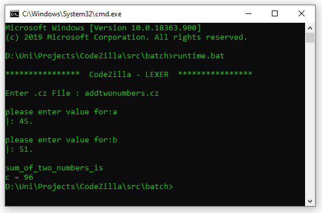

#SER 502 Project: Compiler and Virtual Machine for a Programming Language


**Sample CodeZilla code snippet to add two numbers:**
```bash
#program to add two numbers
start;

var a;
var b;
var c;

c = 0;

read a endread;
read b endread;

c = a + b;

show << sum of two numbers is >> endshow;
show c endshow;

end;
```

**CodeZilla Output**



**Requirements:**
- Python3
- SWIPL.

**System on which compiler and runtime are built:** Windows

**Tool used:** Python, Atom, SWIPL, SWI-SH

## YouTube link
[CodeZilla](https://www.youtube.com/watch?v=pqQUxUurmqc&t=470s)

## Presentation link
[Presentation slides PDF](/doc/Presentation.pdf)

## Installation
- Use the package manager [pip](https://pip.pypa.io/en/stable/) to install libraries required for the lexical analyzer.
```bash
    pip install sly
    pip install simplejson
```

# Execution
## Runtime steps
- Import project folder in your local system.
- Create the CodeZilla (.cz) file in 'data' folder.
- In the 'src' folder, run the lexical analyzer as
```bash
    python lexer.py
```
- Input the desired file's name to generate the token (.tok) file in the 'data' folder.
- **COMPILER:** In the 'src/compiler' folder, execute the compiler in SWI Prolog to generate the parse tree (.pt) file in the 'data' folder.
```bash
    ?- codezilla('filename.tok')
```
- **RUN TIME:** In the 'src/runtime' folder, execute the interpreter in SWI Prolog to evaluate the parse tree and obtain the output.
```bash
    ?- codezilla('filename.pt')
```
- The output will be displayed in the SWI Prolog terminal.


## Bash script
**Set up environment variables for:**
- Python3
- SWIPL.


- Navigate to 'src/batch/' and open command prompt.
- Execute
```bash
    runtime.bat
```
- When prompted, input the desired file's name to obtain the output.

## Extra features added
- Supports code with user input prompts (read).
- Comparison operators <, <=, >, >=, == are implemented.
- Single line comments can be made anywhere in the code.
- Int and float datatypes are supported.
- Paranthesis in expression assignment.
